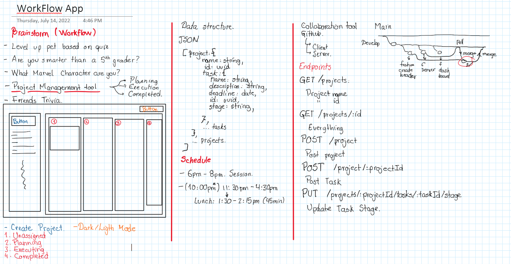
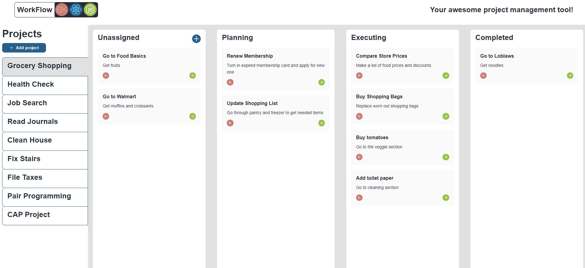
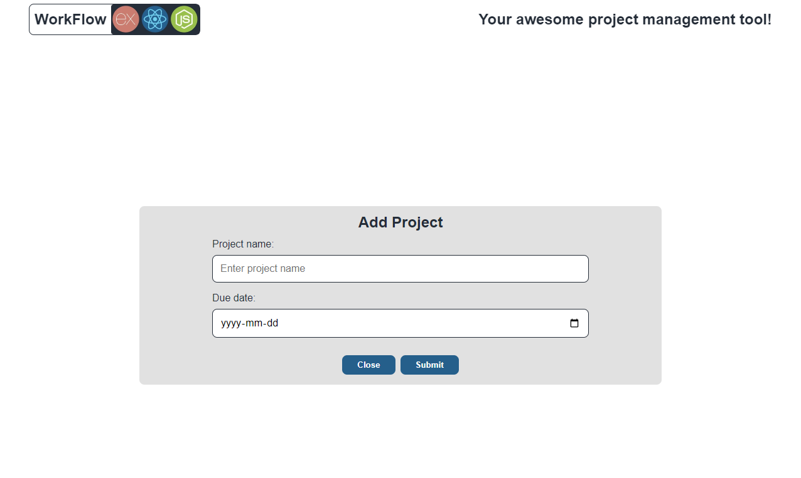
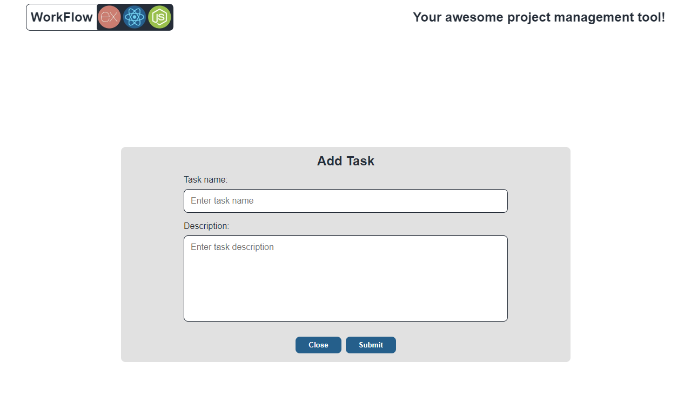

# **WorkFlow App**
### This was a project done in collaboration with: 
- Anastasia Andu (Back-end).
- Me (Front-End).

WorkFlow App lets you manage projects every step of the way from initiation and closing. You can breakdown your project into tasks with descriptions and assign them to different stages such as 'Not complete', 'Planning', 'Executing' and 'Completed'.

## ***Technologies***: 
### **- Front-end:**
1. React: JS library allowed to quickly add visual components that can be reused throughout the app. It allowed for nice rerendering as our app state changed. 
2. SCSS: Superset of CSS that easily helped break down styling with BEM convetion.
3. Axios: NPM package allowed for easy connection to our Express Server endpoints.
### **- Back-end:**
1. Node.js: Used for the app due to its scalability, ease of use, and adaptation. This project was time-sensitive and Node was very effective in carrying out the required tasks.
2. Express: Used for the back-end as well to keep the language consistent with the front-end. It also supports Node.js and NPM packages, making the process easier.

# Project:
### - Planning

### - Home Page

### - Add Project

### - Add Task

Project completed in under 24 hrs. 